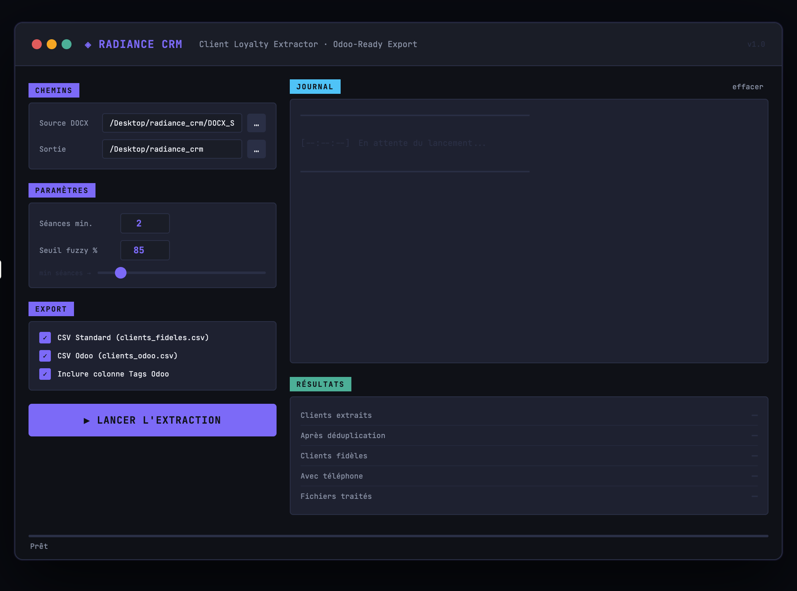

# 🌟 Radiance CRM — Client Loyalty Extractor

> **Pipeline de données desktop** qui extrait les clients fidèles depuis des fichiers `.docx` d'agenda, déduplique les entrées par fuzzy matching, et exporte des CSV prêts à importer dans **Odoo CRM** — le tout depuis une interface graphique Tkinter.


---

## 📸 Interface



---

## 📋 Contexte

Un centre bien-être gérait ses rendez-vous dans **des dizaines de fichiers Word** — formats incohérents, noms/téléphones mélangés, doublons entre fichiers, aucune base centralisée.

**Objectif :** identifier automatiquement les clients fidèles (≥ 2 séances), dédupliquer, et produire un fichier propre pour Odoo CRM — en remplaçant un processus 100% manuel.

---

## 🎯 Fonctionnalités

| Fonctionnalité | Description |
|---|---|
| **Parsing DOCX** | Extraction depuis tableaux Word non structurés via `docx2python` |
| **Parsing intelligent** | Extraction regex nom + téléphone depuis cellules format mixte |
| **Normalisation dates** | Parsing multi-format français via `dateparser` |
| **Déduplication fuzzy** | Fusion des doublons entre fichiers avec `rapidfuzz` |
| **Filtre fidélité** | Seuil de séances configurable (défaut ≥ 2) |
| **Double export CSV** | Format standard + format Odoo (avec/sans colonne Tags) |
| **Interface graphique** | Application Tkinter complète — aucune ligne de commande |
| **Journal temps réel** | Logs horodatés avec codes couleur |

---

## 🗂️ Structure

```
radiance-crm/
├── radiance_crm_app.py   # Application principale (GUI + pipeline)
├── main.py               # Script CLI extraction original
├── main2.py              # Script CLI conversion Odoo original
├── requirements.txt
├── assets/
│   └── screenshot.png
└── README.md
```

---

## ⚙️ Installation

```bash
git clone https://github.com/YOUR_USERNAME/radiance-crm.git
cd radiance-crm
pip install -r requirements.txt
```

---

## 🚀 Utilisation

```bash
python radiance_crm_app.py
```

1. Sélectionner le dossier `.docx`
2. Choisir le dossier de sortie
3. Ajuster les paramètres
4. Cliquer sur **▶ LANCER L'EXTRACTION**

---

## 🧠 Point technique clé — Déduplication fuzzy

```python
def calculate_similarity(c1, c2) -> float:
    name1 = f"{c1['nom']} {c1['prenom']}".strip()
    name2 = f"{c2['nom']} {c2['prenom']}".strip()
    score = fuzz.ratio(name1.lower(), name2.lower())
    # Correspondance téléphone → boost à 95%
    if c1['telephone'] and c2['telephone'] and c1['telephone'] == c2['telephone']:
        return max(score, 95.0)
    return score
```

---

## 💼 Impact métier

- ⏱️ Traitement réduit de ~3h/mois à moins de 2 minutes
- 🧹 Suppression des doublons dans Odoo CRM
- 📞 Campagnes de relance ciblées rendues possibles

---

## 🏷️ Tags

`data-cleaning` `nlp` `fuzzy-matching` `tkinter` `odoo` `crm` `automation` `python` `docx-parsing`

---

*Projet freelance réel — données clients anonymisées.*
